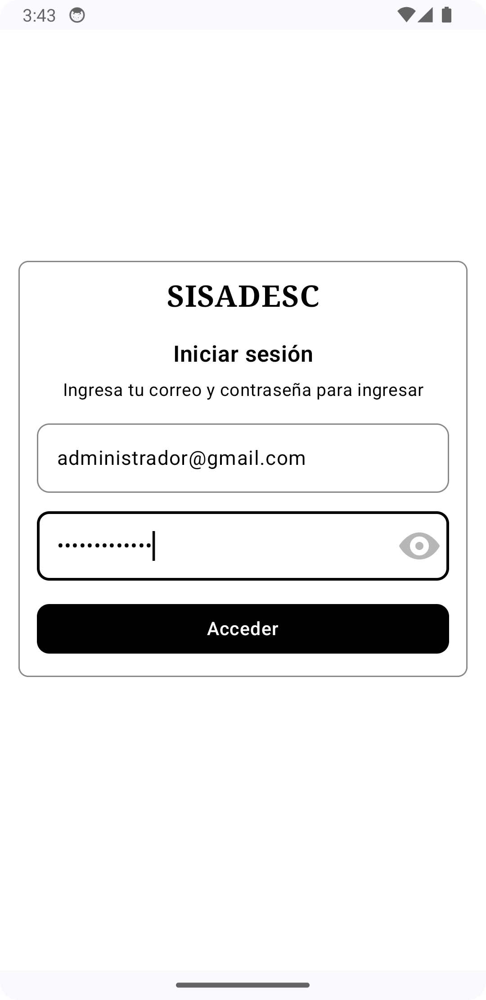

# Sisadesc: Versión Android
Sisadesc es una aplicación móvil desarrollada en Kotlin utilizando Jetpack Compose. Esta aplicación es la versión móvil de la aplicación web existente y sirve como ejemplo de cómo sería la versión móvil de la misma ([Proyecto Web](https://github.com/Alba2809/sisadesc)). El SDK utilizado para este proyecto es el 26.

## Funcionalidades
La aplicación utiliza Firebase Auth para la autenticación de usuarios y Firestore para el manejo de datos. Entre los módulos/funciones creados en esta aplicación se incluyen:

### Splashscreen


### Home


### Login


### Gestión de Usuarios
 

### Posts (Avisos)
 

### Eventos (Calendario con eventos)
 

## Dependencias
El proyecto utiliza varias dependencias para diferentes funcionalidades. A continuación se presenta una lista de todas las dependencias utilizadas:

- Firebase: 
```bash
implementation(platform("com.google.firebase:firebase-bom:33.1.0"))
implementation("com.google.firebase:firebase-auth")
implementation("com.google.firebase:firebase-firestore")
```

- Navigation:
```bash
implementation("androidx.navigation:navigation-compose:2.7.7")
```

- LiveData:
```bash
implementation("androidx.lifecycle:lifecycle-runtime:2.8.1")
```

- Splashscreen:
```bash
implementation("androidx.core:core-splashscreen:1.0.1")
```

- AsyncImage:
```bash
implementation("io.coil-kt:coil-compose:2.6.0")
```

- Calendar / Time:
```bash
implementation("io.github.boguszpawlowski.composecalendar:composecalendar:1.3.0")
implementation("org.jetbrains.kotlinx:kotlinx-datetime:0.5.0")
```

## Instalación
1. Clonar repositorio
```bash
git clone https://github.com/Alba2809/sisadesc_android
```

2. Abrir el proyecto en Android Studio.

3. Sincronizar las dependencias y compilar el proyecto.

4. Configurar Firebase en la aplicación:
    - Crear un proyecto en Firebase.
    - Añadir la configuración de Firebase a la aplicación.
    - Descargar el archivo google-services.json y colocarlo en el directorio app.

5. Ejecutar la aplicación en un dispositivo o emulador con Android SDK 26 o superior.

# Contribución
Los consejos y/o sugerencias para mejorar algún aspecto son bienvenidas :D

